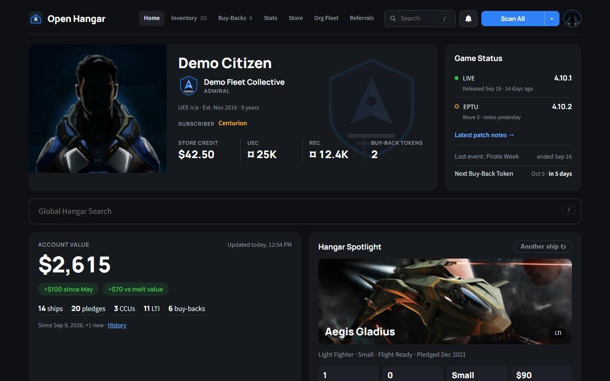

# Open Hangar

**The free Star Citizen fleet manager.**

[](https://github.com/Draco-Foundry/open-hangar/releases/latest)
[](https://chromewebstore.google.com/detail/open-hangar/aeabioadfphghjennmdbnpelojlhndjl)
[](https://addons.mozilla.org/en-US/firefox/addon/open-hangar/)
[](https://microsoftedge.microsoft.com/addons/detail/fmcnemfepnifokjelgjacgdhoodaiicl)
[](LICENSE)

Open Hangar comes in two parts that work together:

- **The Extension** for Chrome, Edge and Firefox reads your own RSI account right in your
  browser: every pledge, buy-back, balance and referral, made useful.
- **The Website**, [openhangar.space](https://openhangar.space/), has Star Citizen news and
  store tools today. At the **November 10, 2026** launch it also becomes your fleet manager:
  My Hangar on any device, a store that knows what you own, and a page for every ship.

Free for every pilot: no subscriptions, no premium tier, no paid features, and your data is
never sold.

**[Get Open Hangar](#get-open-hangar)** · [Road to Launch](#road-to-launch-november-10-2026) ·
[Full Roadmap](ROADMAP.md) · [Recently Shipped](#recently-shipped) ·
[Discord](https://discord.gg/FF8Wm5HdnV)

> Unofficial fan project, not affiliated with Cloud Imperium Games or RSI. Open Hangar only
> ever reads **your own** account.



## Get Open Hangar

The extension runs in Chrome, Edge and Firefox on a computer. Pick your browser on
[openhangar.space/extension](https://openhangar.space/extension), which shows each store's
current version, or go straight to a store:

- [Chrome Web Store](https://chromewebstore.google.com/detail/open-hangar/aeabioadfphghjennmdbnpelojlhndjl)
  (also for Brave, Opera and Vivaldi)
- [Microsoft Edge Add-ons](https://microsoftedge.microsoft.com/addons/detail/fmcnemfepnifokjelgjacgdhoodaiicl)
- [Firefox Add-ons](https://addons.mozilla.org/en-US/firefox/addon/open-hangar/)

Then:

1. Sign in to [RSI's Website](https://robertsspaceindustries.com/) in the same browser.
2. Click the Open Hangar icon in your toolbar to open your hangar.
3. Hit **Scan All**, then explore Home, Inventory, Buy-Backs, Stats and more.

Re-scan any time to refresh. **Clear Data** wipes the local copy, and **Log Out of RSI**
ends your RSI session.

The website works in any browser, phone included, and from the Nov 10 launch that's where
My Hangar lives.

A small beta for 0.3.0 runs Oct 20 to 27 with testers from our
[Discord](https://discord.gg/FF8Wm5HdnV), and spots are limited.
[Beta Details](https://openhangar.space/beta)

## Where We're Headed

- **The Website Becomes Your Fleet Manager.** My Hangar on any device, store tools that know
  what you own, a page for every ship, and later your org and the wider community.
- **The Extension Stays Your Scanner.** It keeps reading your own RSI account in your browser
  and keeps getting better at it. From Nov 10 (extension 0.3.0), new features land on the
  website.
- **Your Data, Your Call.** From Nov 10 you can choose to sync: connect a free
  openhangar.space account and the extension syncs after every scan. Or skip it, and
  everything stays in your browser. Disconnect any time.

## Road to Launch: November 10, 2026

Extension 0.3.0 and the website launch together, and sign-ups open to everyone.

Website features come in **waves**, batches that are built and tested ahead of launch. A
wave's date is when it's built, not when you get it: Waves 1 to 3 are planned for launch day.
Anything that isn't ready and tested in time stays switched off until it is.

**Shipped** means you can use it now. **Built** means it's done and arrives Nov 10. All dates
are 2026, in UTC. Each bar fills as its tasks are done:

[](https://github.com/Draco-Foundry/open-hangar/milestone/6)
[](https://github.com/Draco-Foundry/open-hangar/milestone/7)
[](https://github.com/Draco-Foundry/open-hangar/milestone/8)
[](https://github.com/Draco-Foundry/open-hangar/milestone/9)
[](https://github.com/Draco-Foundry/open-hangar/milestone/4)

- [x] **Sep 28 to 30:** Shipped. Open Hangar is live on the Chrome, Edge and Firefox stores.
- [x] **Oct 2 to 7:** Shipped. openhangar.space becomes a Star Citizen news hub and opens the
      Open Hangar Store.
- [x] **Oct 6:** Built. The [0.3.0 Redesign](https://github.com/Draco-Foundry/open-hangar/milestone/3) rebuilds every
      extension page in one clean look. Arrives Nov 10.
- [ ] **Oct 16:** [Wave 1: Core Hangar Manager](https://github.com/Draco-Foundry/open-hangar/milestone/6)
      built. My Hangar on the website, a page for every ship, and store badges for what you
      own.
- [ ] **Oct 16 to 19:** bug-fix days, with no new features.
- [ ] **Oct 20 to 27:** a small beta with 5 to 10 testers from our Discord.
- [ ] **Oct 25:** [Wave 2: Your Hangar Meets the Store](https://github.com/Draco-Foundry/open-hangar/milestone/7)
      built and in testing.
- [ ] **Oct 27:** last extension changes in, then a final check before the stores.
- [ ] **Oct 28:** 0.3.0 goes to the Chrome, Edge and Firefox stores for review.
- [ ] **Nov 3:** [Wave 3: Finishing Touches](https://github.com/Draco-Foundry/open-hangar/milestone/9) built.
- [ ] **Nov 10: [Launch](https://github.com/Draco-Foundry/open-hangar/milestone/4).** Extension 0.3.0
      and the website launch together, and sign-ups open to everyone.
- [ ] **Then:** four weeks of bug fixes and keeping ship and store data accurate.

The Oct 27 cut-off is for the extension, which needs store review. Website features can keep
landing until launch, and each one is tested before it's switched on. Every feature has its
own issue in the pinned [Road to Launch Tracker](https://github.com/Draco-Foundry/open-hangar/issues/468), and every step
is in
[All Milestones](https://github.com/Draco-Foundry/open-hangar/milestones?direction=asc&sort=due_date&state=open).

## After Launch

- **First Four Weeks:** bug fixes and keeping ship and store data accurate. No new features.
- **[December 2026](https://github.com/Draco-Foundry/open-hangar/milestone/10) (Planned):** community features on the
  website. Org Fleet (ships only, never prices or what anyone paid), Looking for Crew, Events
  (public, org or private) and phone alerts.
- **[Early 2027](https://github.com/Draco-Foundry/open-hangar/milestone/11):** on the website, value and savings, a trade post
  builder, a sale calendar, your hangar timeline, a shareable fleet card and a store credit
  check.
- **[Later in 2027](https://github.com/Draco-Foundry/open-hangar/milestone/12):** org matchmaking, Year in Review, starting
  a scan from the website, and more languages, one at a time.
- **Not Planned:** rankings or comparing players' hangars, CCU chain planning, Safari, and
  reading anyone else's account. [Here's Why](ROADMAP.md#not-planned-and-why)

Anything after launch is a plan, not a promise. The details are in the
[Full Roadmap](ROADMAP.md).

## Recently Shipped

- [x] **Oct 6 to 7, 2026 · Website:** the store adds Compare (up to three items side by side),
      prices in your own currency and a What's New view of the latest drops. Pilots with a
      synced hangar (beta testers until launch) see an In Your Hangar mark on what they own,
      and can hide owned items.
- [x] **Oct 6 to 7, 2026 · Website:** a fresh front page with today's top stories, Ships in
      the News, a Patch, Roadmap and Issues card, and each subscriber tier's Vehicle of the
      Month.
- [x] **Oct 6 to 7, 2026 · Website:** the [Open Hangar Beta](https://openhangar.space/beta)
      page for Discord testers, with what to test and how to install the test build.
- [x] **Oct 5, 2026 · 0.2.18 and 0.2.19:** Reclaim on an upgrade buy-back opens the right
      item, and the next buy-back token date keeps working past RSI's posted 2026 dates.
- [x] **Oct 4, 2026 · 0.2.17:** much faster rescans when nothing has changed, and full-size
      pictures.
- [x] **Oct 3, 2026 · Website:** the [Open Hangar Store](https://openhangar.space/store) lists
      every item RSI sells, with its sale history, how often RSI sells it and insurance.

**[Everything We've Shipped](ROADMAP.md#shipped)** ·
[Release Notes](https://github.com/Draco-Foundry/open-hangar/releases) ·
[Changelog](CHANGELOG.md)

## What You Get Today

**In the Extension (0.2.19):**

- **Your Whole Hangar:** every pledge with what's inside, its value and insurance, and
  whether you can melt or gift it. Search, filters and three views.
- **What It's Worth:** Account Value at today's store prices, what changed between scans,
  and a Melt Planner.
- **Buy-Backs:** everything you can reclaim, with links that open the right item on RSI,
  plus your buy-back token count.
- **Home:** your Citizen Card with balances, Game Status and Hangar Alerts.
- **Your Fleet:** cargo, crew and role stats, a fleet picture to share, and Org Fleet, which
  puts your org mates' ship lists together as one fleet.
- **Referrals:** recruits, reward tiers, event bonuses and a share image.
- **Wishlist:** the ships you want, with a check for whether they're in the store now.
- **Your Data, Your Way:** export to JSON or CSV, import JSON, or export a Hangar Transfer
  Format file that other community fleet tools can read.

**On [openhangar.space](https://openhangar.space/):**

- **Star Citizen News:** game status, an events calendar, what's live now, ships in the news
  and short summaries of official RSI posts.
- **The [Open Hangar Store](https://openhangar.space/store):** every item RSI sells, with its
  sale history, how often RSI sells it, insurance, side-by-side compare and prices in your
  own currency.
- **Accounts:** up and running, with sign-ups invite-only until launch. You can download
  everything the website holds about you from your Account page.

## Privacy

- **Your Own Account Only.** Open Hangar uses the RSI session you're already signed in with
  and never sees your password.
- **Read-Only Scans.** Scans only read, and they pace their requests so RSI's site isn't
  flooded.
- **Today (0.2.19):** no account and no sign-up, and your hangar data stays in your browser.
  A few read-only requests fetch public data, like the game version, ship art and exchange
  rates. None of them carry your personal data, but ship-art lookups are made by ship name,
  so they weakly hint at which ships you're viewing. The `cookies` permission is used only by
  **Log Out of RSI**. Each RSI account's data is kept separately, so accounts never mix.
- **From 0.3.0 (Launching Nov 10, 2026):** you can choose to sync with openhangar.space.
  Nothing from your hangar is sent until you connect a free account, and you can disconnect
  any time. With or without sync, the extension talks only to RSI and openhangar.space.

[Extension Privacy Policy](https://openhangar.space/privacy.html) ·
[Website Privacy Policy](https://openhangar.space/privacy)

## For Developers

Open Hangar is also the data layer RSI doesn't offer. There's no public API, so Open Hangar
handles the session and the page parsing and hands you clean records.

<details>
<summary><strong>Build From Source</strong></summary>

```bash
git clone https://github.com/Draco-Foundry/open-hangar.git
cd open-hangar
npm install
npm run build
```

- **Chrome, Edge, Brave:** open `chrome://extensions`, turn on **Developer mode**, click
  **Load unpacked** and pick `dist/chrome`.
- **Firefox (140+):** open `about:debugging`, then **This Firefox**, then **Load Temporary
  Add-on**, and pick `dist/firefox/manifest.json`.

</details>

<details>
<summary><strong>What It Reads</strong></summary>

- **Hangar:** every pledge (ships, CCUs `from → to`, paints, add-ons, coupons) with its
  contents, value, date, insurance, and whether it's giftable or meltable.
- **Buy-Backs:** melted pledges you can get back, each with a direct reclaim link.
- **Account:** handle, display name, Store Credit, UEC, REC, main org and rank.
- **Referrals:** recruits and prospects (current and legacy programs), reward tiers, event
  bonuses and charts.

Everything lives in one versioned database in your browser, and exports as one JSON file, a
CSV of what a page shows, or a Hangar Transfer Format (HTF) file.

</details>

<details>
<summary><strong>The Data</strong></summary>

Every pledge is normalized to one object:

```js
{ id, name, value, currency,
  contents: [{ kind, label, image }],   // items inside the pledge
  image, containsShip,
  isCCU, ccu: { from, to },
  isAddOn, isCoupon, isPaint,
  giftable,                              // hangar offers a "Gift" action
  insurance,                             // 'LTI' | '120M' | '6M' | … | null
  kind }                                 // ship | ccu | paint | addon | coupon | other
```

Sources live in a registry (`OH.SOURCES`) and persist as one versioned object:
`{ schemaVersion, sources: { hangar, buybacks, referral }, owner }`.

The **JSON export** wraps that with provenance and an identity block, ordered from who to
what they own:

```js
{ app, appVersion, exportedAt, schemaVersion,   // provenance
  account: {                                     // identity snapshot
    handle, displayName, avatar,
    ueeRecord, enlistedSince, country,
    organization: { name, sid, rank, logo },     // null if none / private
    subscriber, concierge,
    balances: { storeCredit, uec, rec },         // storeCredit.value is in cents
    capturedAt },
  sources: { hangar: {…}, buybacks: {…},
    referral: { items: { current, legacy, prospects,
                         recruitsList, prospectsList } } },  // referral code/url never exported
  history: [ { at, items: [[id, name, value]] } ] }        // scan snapshots; merged on import
```

</details>

<details>
<summary><strong>How It Works</strong></summary>

RSI signs you in with a session cookie. Because the extension has host permission for
`robertsspaceindustries.com`, its own requests carry your existing session: no password and
no RSI tab needed. Pages are fetched and parsed in your browser (referrals come from RSI's
GraphQL API). Scans are read-only and rate-limited.

RSI updates its site from time to time. All HTML parsing is isolated in
`src/scraper/parser.js`, so when the markup changes there's one place to fix.

```
manifest.json           permissions + config (Chrome-shaped; see scripts/pack.mjs)
src/
  background.js         opens the hub when the toolbar icon is clicked
  lib.js                source registry, scan loop, storage, export/import
  scraper/parser.js     RSI HTML -> normalized model   (the layer to maintain)
  dashboard.html / .js  the viewer
ui/                     Svelte pages, built with Vite
scripts/pack.mjs        builds per-browser bundles into dist/
```

The [Architecture Tour](ARCHITECTURE.md) walks through it all in about ten minutes.

</details>

<details>
<summary><strong>Export, Import and Commands</strong></summary>

The contract is the data shape above plus **JSON export and import** on the Developers page:
pull the whole database out as one self-describing file, or restore it. Import restores
holdings; the `account` block is a read-only snapshot.

**Export HTF** writes the community Hangar Transfer Format: one entry per ship with
`ship_code`, manufacturer, `pledge_*`, `lti` and `warbond`, ready for any fleet tool that
reads HTF. Ship codes come from a bundled MIT-licensed table in `src/data/` (credited in the
[Third-Party Notices](THIRD_PARTY_NOTICES.md)). CCUs, paints and add-ons have no HTF
equivalent and are skipped.

Useful commands:

- `npm test`: the test suite
- `npm run build`: per-browser bundles in `dist/chrome` and `dist/firefox`
- `npm run pack`: store-ready zips in `dist/`
- `npm run lint:firefox`: Mozilla's `web-ext lint` against the Firefox build
- `npm run screenshots`: store screenshots (real UI, demo data) into `docs/store-assets/`
- `npm run demo`: the same demo dashboard at `localhost:8323`, for trying UI changes
- `npm run format`: Prettier

To add a data source, see the [Contributing Guide](CONTRIBUTING.md).

</details>

## Ideas, Bugs and Help

- **Got an Idea?** Post it in
  [Ideas Discussions](https://github.com/Draco-Foundry/open-hangar/discussions/categories/ideas)
  and upvote the ones you want most. That's how we pick what to build next.
- **Found a Bug?** [Open an Issue](https://github.com/Draco-Foundry/open-hangar/issues/new/choose).
  If a scan breaks, the extension's **Report a Scan Problem** button fills in the details for
  you. It opens a GitHub issue, so it needs a GitHub account.
- **No GitHub Account?** Tell us on [Discord](https://discord.gg/FF8Wm5HdnV) or at
  [support@openhangar.space](mailto:support@openhangar.space).
- **See What's Open:**
  [Open Bugs](https://github.com/Draco-Foundry/open-hangar/issues?q=is%3Aissue+is%3Aopen+label%3Abug)
  ·
  [All Milestones](https://github.com/Draco-Foundry/open-hangar/milestones?direction=asc&sort=due_date&state=open)

## Contributing

The most valuable help is keeping the RSI reader working when RSI updates its site. Start
with the [Contributing Guide](CONTRIBUTING.md); the [Architecture Tour](ARCHITECTURE.md)
shows how it all fits together in about ten minutes. This repo holds the extension's code,
and website features are tracked here as issues too.

## Terms and Fair Use

Scans are read-only and rate-limited, and Open Hangar reads only the signed-in pilot's own
account. Respect [RSI's Terms of Service](https://robertsspaceindustries.com/tos) and don't
redistribute other people's data.

## License and Community

Code: source available under the [PolyForm Strict License 1.0.0](LICENSE). Read it, audit it
and use Open Hangar, but don't redistribute it or publish modified versions. Releases before
0.2.12 were MIT. Third-party code keeps its own license
([Third-Party Notices](THIRD_PARTY_NOTICES.md)). Open Hangar uses no Star Citizen Fankit
assets. Star Citizen® and related names are trademarks of Cloud Imperium Rights LLC; this is
an unofficial fan project, not affiliated with the Cloud Imperium group of companies.

- **Website:** [openhangar.space](https://openhangar.space/)
- **Discord:** [Draco Foundry](https://discord.gg/FF8Wm5HdnV)
- **Email:** [support@openhangar.space](mailto:support@openhangar.space)
- **Security Issues:** please report privately, see the [Security Policy](SECURITY.md).

See you in the 'verse. o7
